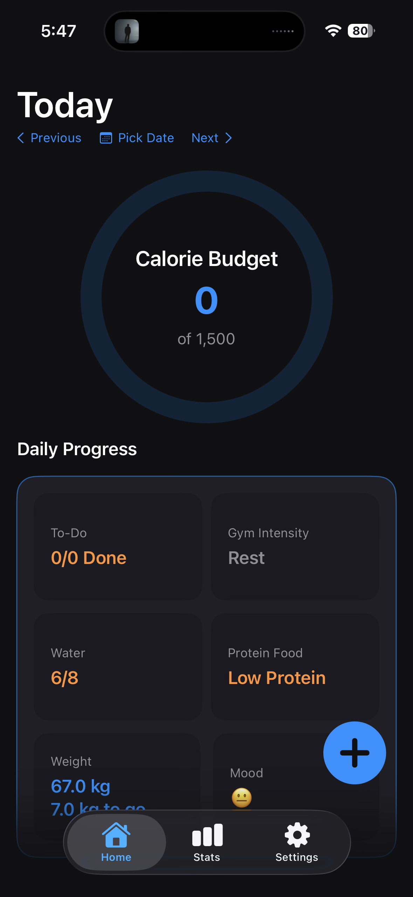
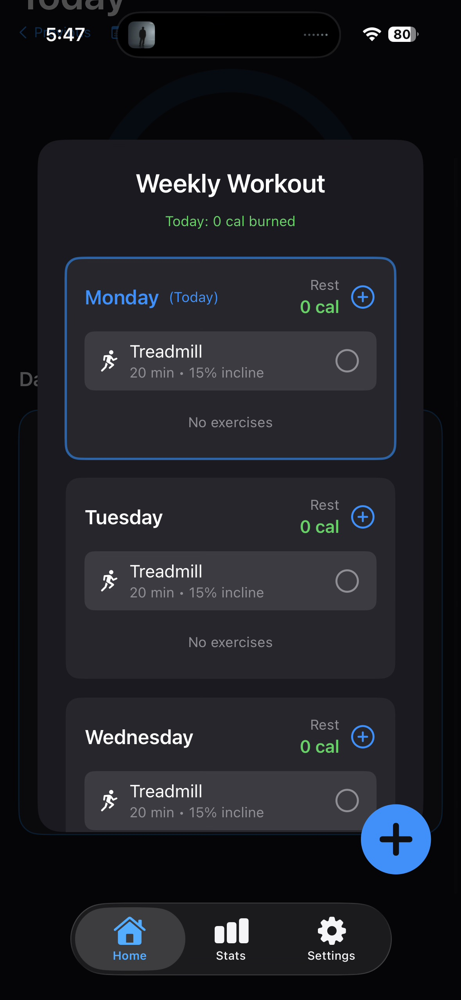
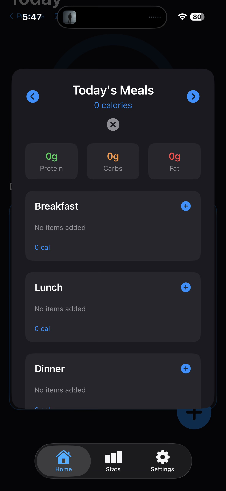

# LifeOS — Your Personal Operating System 🖥️

<div align="center">
  
[](https://developer.apple.com/ios)
[](https://swift.org)
[](https://developer.apple.com/xcode/swiftui/)
[](https://developer.apple.com/healthkit/)
[](LICENSE)

</div>

## 📌 Overview

**LifeOS** is an intelligent life management iOS app that unifies health, fitness, nutrition, and daily tracking into a single cohesive dashboard. Designed with SwiftUI and powered by HealthKit integration, LifeOS helps you achieve data-driven self-improvement with a frictionless user experience.

**Why LifeOS?** Most life tracking apps are siloed. LifeOS creates a unified operating system for your personal data, giving you actionable insights at a glance.

---

## 🗺️ What's in this repository (status: 3 Oct 2026)

Three plans drive the work: **UI/UX**, **AI** and **engineering**. Each has its own docs folder, its own code area and its own status file. Commits on `main` follow the same split, so `git log` reads as "who built what".

| Workstream | Plan | Code | Status | Start here |
|---|---|---|---|---|
| **App baseline** (Sept 2026) | — | `LifeOS/`, `LifeOS Watch App/` | Meal-vision engine with model fallback and learning from corrections, DesignSystemKit, Home revamp | commit `feat: free meal-vision engine…` |
| **Platform (Phase 0)** | [`docs/engineering-roadmap/`](docs/engineering-roadmap/00-MASTER-PLAN.md) | `Packages/LifeOSKit/` (LifeOSCore · LifeOSData · LifeOSConnectivity), app managers, `LaunchGate` | Storage moved to an on-device date-keyed store with a verified one-time migration; typed watch contract; CI and lint | [`P0-STATUS.md`](docs/engineering-roadmap/P0-STATUS.md), [ADRs](docs/adr/) |
| **AI (Phase 0)** | [`docs/ai-team/`](docs/ai-team/00-AI-MASTER-PLAN.md) | `LifeOS/AI/`, root `Package.swift`, `Evals/`, `Tests/`, `Tools/ai-eval/` | AI Gateway with tiered providers, privacy gate and consent, quotas, eval harness; meal scanner runs through it | [`PHASE-0-REPORT.md`](docs/ai-team/phase-0/PHASE-0-REPORT.md), [module guide](docs/ai-team/03-ai-module-guide.md) |
| **UI/UX (Phases 1–2)** | [`docs/uiux-plan/`](docs/uiux-plan/00_UIUX_Master_Plan.md) | `LifeOS/DesignSystem/`, `design/`, `Packages/LifeOSDesign/` | Audit, three visual directions, Life Orb, 30-component design system, Direction Lab in Settings. Waiting on the owner's direction pick (gate D1) | [Phase 1](docs/uiux-plan/phase1/README.md), [Phase 2](docs/uiux-plan/phase2/README.md) |

**Try the new UI:** Profile → ⚙︎ Settings → **Direction Lab**. There you can switch between the Obsidian, Porcelain and Aurora directions, play with the Life Orb, browse the mockups, and open the component gallery. Everyday screens keep their current look until UI/UX Phase 3.

All docs are indexed in [`docs/README.md`](docs/README.md).

---

## ✨ Key Features

- 🏋️ **Unified Fitness Dashboard** - Real-time stats from Apple Watch & Health
- 🥗 **Smart Nutrition Tracking** - Log meals and auto-sync with HealthKit
- 💧 **Smart Water Tracker** - Interactive tap-and-drag gestures for seamless hydration logging
- 📊 **Analytics & Insights** - Weekly/monthly trends and progress visualization
- ⏰ **Schedule Management** - Meal times, workout reminders, daily goals
- 🎯 **Goal Setting** - Define targets and track completion rates
- 💪 **Habit Tracking** - Build streaks and monitor discipline
- 📝 **Task Manager & Reminders** - Apple Reminders-style UI with custom preset Local Push Notifications
- 🎨 **Fluid UI/UX** - Featuring a custom liquid-glass floating tab bar and a unified design system
- 🔄 **Real-time Sync** - Seamless HealthKit integration
- 🌙 **Dark Mode Support** - Native iOS dark mode compatibility
- ⌚ **Apple Watch App** - Companion watchOS app with automatic set tracking, water logging, todos, and a live dashboard synced over WatchConnectivity

---

## ⌚ Apple Watch Companion

A native watchOS app (target **LifeOS Watch App**) that pairs with the phone over **WatchConnectivity**:

- **Today dashboard** — calorie ring, water, calories burned, and streak mirrored from the phone.
- **Quick water logging** — +/- from the wrist, synced instantly back to the phone.
- **Automatic set tracking** — pick an exercise (e.g. *Chest → Bench Press*), tap *Start Auto-Track*, and the watch counts sets and reps from wrist motion. Reps are counted as **full motion cycles** ("out-and-back = 1 rep") rather than acceleration spikes: `CoreMotion` is sampled at ~50 Hz, integrated once into a leaky/high-passed **velocity** (which oscillates per rep and self-zeroes at rest, avoiding the drift of position tracking), projected onto the **dominant movement axis** so it self-calibrates to any lift, and one rep is counted per positive→negative oscillation with amplitude and cadence gating. Set boundaries come from a separate sliding-RMS envelope that learns your rest noise floor. A manual "Log Set" fallback is always available.
- **Todo check-off** — see and complete today's todos from the watch.

**How sync works:** the phone pushes a daily *snapshot* via `updateApplicationContext`; the watch sends *mutations* (water, todos, sets) via interactive messages (with a background transfer fallback when unreachable). Writes route through the phone's existing managers so the iPhone UI updates reactively.

> Requires a paired Apple Watch. Motion-based set counting runs while the watch app is in the foreground and is heuristic, tuned for typical resistance-training cadence. Screen-off / background tracking would require an `HKWorkoutSession` (the HealthKit capability, which needs a paid Apple Developer account); the current build keeps the watch app free of the HealthKit entitlement so it signs on a free account.

---

## 🛠️ Tech Stack

| Layer | Technology |
|-------|-----------|
| **UI** | SwiftUI (iOS app + watchOS companion) |
| **State** | `ObservableObject` managers + view models; moving to `@MainActor`/actors (FND-13) |
| **Data** | `LifeOSData` date-keyed file store with Data Protection ([ADR 0001](docs/adr/0001-persistence.md)); one-time verified migration from the old `UserDefaults` JSON runs behind `LaunchGate` |
| **Design system** | `LifeOS/DesignSystem` (`LX*` tokens and components) generated from `design/tokens/*.json`; Life Orb in SwiftUI Canvas, RealityKit spike |
| **Health** | HealthKit (dietary energy, weight, sleep, steps, active energy) |
| **Watch sync** | WatchConnectivity (typed contract in `LifeOSConnectivity`, FND-11) |
| **AI** | Groq vision via `MealVision`, with Apple Vision fallback and on-device learning from corrections |
| **Dependencies** | None (no third-party packages) |
| **Minimum OS** | iOS 17.6 · watchOS 10 |
| **Toolchain** | Xcode 26+ (verified on Xcode 27 with an iPhone 15) · Swift 6 for packages (app target still in Swift 5 mode) |

---

## 🏗️ Architecture

```
LifeOS/                      iOS app target (Xcode synchronized folder: new files are picked up automatically)
├── LifeOSApp.swift          @main, AppDependencies (DI container)
├── ContentView.swift        root tabs
├── Managers/                HealthManager, Food/Workout databases, persistence, theme
├── Models/                  MealModels, UserProfile
├── Services/                calorie maths, notifications, barcode lookup, watch bridge
│   └── MealVision/          photo meal analysis + learning engine
├── App/                     LifeOSKitExports (re-exports LifeOSCore into the app)
├── Data/                    LocalStore (app-side LifeOSData store)
├── AI/                      AI team's module (also built by the root Package.swift)
├── DesignSystem/            LX design system: tokens, foundations, components, Life Orb, Direction Lab
└── Views/                   screens and components (LaunchGate runs the data migration)
LifeOS Watch App/            watchOS companion (dashboard, water, todos, auto set tracking)
Packages/LifeOSKit/          shared Swift 6 package: LifeOSCore · LifeOSData · LifeOSConnectivity
Packages/LifeOSDesign/       test harness for LifeOS/DesignSystem (symlinked sources, snapshots)
design/tokens/               design tokens, the single source of truth (3 directions + core)
design/tools/                token generator, contrast/colour-blind checks, raw-colour ratchet, board builder
Package.swift, Evals/, Tests/, Tools/ai-eval/   AI module test and eval harness
docs/                        plans (UI/UX, AI, engineering), ADRs, phase reports (index: docs/README.md)
scripts/test-packages.sh     builds and tests the local packages (works with Xcode or just the CLT)
```

The engineering plan is in [`docs/engineering-roadmap/`](docs/engineering-roadmap/00-MASTER-PLAN.md). Phase 0 progress is tracked in [`P0-STATUS.md`](docs/engineering-roadmap/P0-STATUS.md).

---

## 🚀 Quick Start

### Prerequisites
- Xcode 26 or later
- An Apple Developer account to run on a device (HealthKit, Watch)

### Run
```bash
git clone https://github.com/intenzee/LifeOS.git
cd LifeOS
open LifeOS.xcodeproj
```
Select the **LifeOS** scheme (it embeds the Watch app) and press `Cmd + R`. HealthKit usage strings are already in `LifeOS/Info.plist`.

---

## 📱 Screenshots

<div align="center">
  
  
  
</div>

---

## 🎯 How It Works

### User Flow

```
App Launch → Dashboard → User Action
                       ├── Log Workout → FitnessTab → HealthKit Sync → Real-time Update
                       ├── Log Meal → NutritionTab → HealthKit Sync → Real-time Update
                       └── View Goals → AnalyticsView
```

### Key Technical Highlights

**1. HealthKit Integration**

Fetch workouts from HealthKit in real-time with proper permission handling and data synchronization.

**2. SwiftUI + Combine Reactive Updates**

Implement reactive data binding using Combine framework for real-time UI updates when HealthKit data changes.

**3. Date-keyed local storage**

Every record (food, workouts, water, weight, tasks) is keyed by calendar date and source, and stored on device in protected, month-sharded files behind repository protocols. See [ADR 0001](docs/adr/0001-persistence.md).

---

## 📊 Features in Development

- 🤖 AI-powered meal recognition (Vision Framework)
- 📈 Predictive analytics for goal achievement
- 🎮 Gamification (badges, achievements)
- 🔗 Integration with Apple Watch complications
- 📤 Data export (PDF/CSV)

---

## 🧪 Testing

```bash
./scripts/test-packages.sh   # LifeOSKit: DayKey, calculators, streaks, store, migration, watch contract
swift test                   # AI module harness (root Package.swift)
python3 design/tools/gen_tokens.py --check      # design tokens up to date; contrast + colour-blind rules
python3 design/tools/lint_raw_colors.py         # raw colours in feature code may only go down
(cd Packages/LifeOSDesign && swift test)        # design system: tokens, motion, orb, 33 component snapshots
```

Device builds (no simulator needed):
```bash
xcodebuild -project LifeOS.xcodeproj -scheme LifeOS -configuration Debug \
  -destination id=<iPhone UDID> -allowProvisioningUpdates build
```

CI (`.github/workflows/ci.yml`) runs SwiftLint, both test suites and an iOS + watchOS build on every pull request. App-target unit and UI test targets arrive with QA-01.

Performance budgets (cold launch < 1.0 s on iPhone 13 with a year of data, and others) are defined in the [engineering roadmap](docs/engineering-roadmap/10-quality-ci-release.md) and measured in QA-11.

---

## 🎓 What I Learned

Building LifeOS taught me:
- ✅ Advanced SwiftUI patterns (custom modifiers, view composition, liquid-glass aesthetics)
- ✅ Handling interactive gestures (Sequence interactions for dual tap/drag controls)
- ✅ HealthKit framework and privacy-first design
- ✅ MVVM architecture at scale
- ✅ Real-time data synchronization and date-keyed UserDefaults persistence
- ✅ Push Notifications (`UNUserNotificationCenter`) scheduling and lifecycle management
- ✅ App Store optimization and deployment
- ✅ User-centric design for fitness apps

---

## 📱 App Store

**Status:** Pending Apple Review
**Target Release:** Q1 2026
[Download Link will be here]

---

## 🤝 Contributing

Contributions are welcome! Please follow these steps:

1. Fork the repo
2. Create a feature branch (`git checkout -b feature/AmazingFeature`)
3. Commit changes (`git commit -m 'Add AmazingFeature'`)
4. Push to branch (`git push origin feature/AmazingFeature`)
5. Open a Pull Request

---

## 📝 License

This project is licensed under the MIT License - see LICENSE file for details.

---

## 💬 Connect With Me

- **GitHub:** [@intenzee](https://github.com/intenzee)
- **LinkedIn:** [Tanmay Roy](https://www.linkedin.com/in/tanmay-roy-168846202/)
- **Email:** tanmay2407roy@gmail.com

📌 **Actively seeking iOS Developer internships in 2026!** Interested in discussing LifeOS or collaboration opportunities?

---

## ⭐ If you find this helpful, please star the repo!
