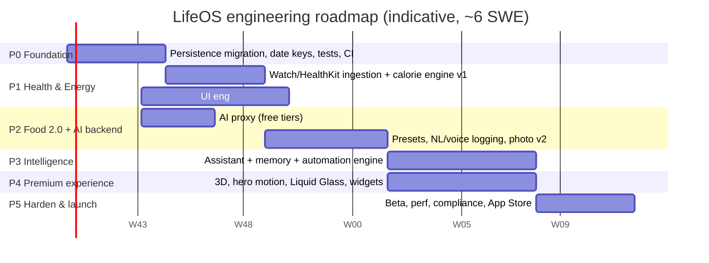
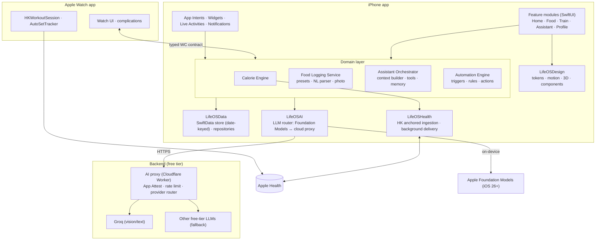

# LifeOS — Engineering Master Plan

> **Audience:** Senior SWE / Tech Lead and the iOS, watchOS and backend engineers on the LifeOS team.
> **Status:** v1.0 — written 2 Oct 2026 from an audit of the `LifeOS-main` repository (commit `0156906`).
> **Scope:** Engineering only. UI/UX design specs come from the design team. This plan defines the engineering work that implements them (see `08-premium-ui-engineering.md`).

---

## 1. Product vision (what we are building)

LifeOS should feel like a **high-end, multipurpose personal operating system**: health, nutrition, training, hydration, sleep, tasks and habits in one app. It should run itself as much as possible:

1. **Zero-effort tracking.** Apple Watch workouts and energy flow in automatically. The calorie budget updates itself in real time. No manual exercise entry unless the user wants it.
2. **Effortless food logging.** The user says or types a phrase ("my usual breakfast", "2 rotis and dal for lunch") or takes a photo. The AI handles the rest: it parses, looks up nutrition, logs, and learns from corrections.
3. **A context-aware AI companion with memory.** It knows the user's day, history, goals and preferences. It can answer questions and take actions (log, remind, plan). Its memory is transparent and the user can edit it.
4. **Automation.** Smart nudges, routines, Siri and Shortcuts, widgets and Live Activities. The app acts at the right moment without being asked.
5. **A premium, fluid experience.** Motion, depth, tasteful 3D and haptics at a consistently high frame rate. It should feel like a well-funded flagship product.
6. **Free to run at personal and beta scale.** AI comes from on-device models first, then free cloud tiers behind our own proxy. Section 7 explains where "free" stops.

---

## 2. Current state — audit summary

The app is a **native SwiftUI iOS app (iOS 17.6 target) plus a watchOS companion (watchOS 10)**. It has no third-party dependencies and no backend. It has a solid base and some significant structural debt.

### What already exists (keep and build on)
| Area | Where | Notes |
|---|---|---|
| Dependency container | `LifeOS/LifeOSApp.swift` (`AppDependencies`) | Good seam for testing and new services |
| Calorie target (Mifflin-St Jeor + goal-gap adjustment) | `Services/CalorieGoalCalculator.swift` | Well documented, has safety floors |
| Meal photo AI with fallback | `Services/MealVision/*` | Groq vision → Apple Vision fallback → learned corrections. The architecture is good. |
| On-device learning from corrections | `MealLearningEngine`, `CorrectionStore`, `ImageSignature` | pHash + Vision feature-print retrieval, few-shot hints. This is a strong differentiator. |
| Barcode lookup | `Services/BarcodeFoodLookup.swift` | OpenFoodFacts |
| HealthKit read/write | `Managers/HealthManager.swift` | Reads dietary energy, weight, sleep, steps, active energy |
| Watch companion | `LifeOS Watch App/*` | Snapshot over WatchConnectivity, motion-based rep counting (`AutoSetTracker`) |
| Streaks / perfect day | `StreakManager.swift`, `StreaksView.swift` | |
| Design tokens (early) | `Managers/AppTheme.swift`, `Managers/DesignSystemKit.swift` | Spacing, radius, palette, typography |
| Local notifications | `Services/NotificationService.swift` | Todo, water and meal reminders |

### Critical issues found (must fix before building features on top)
| # | Issue | Evidence | Impact |
|---|---|---|---|
| C1 | **Workouts and todos are keyed by weekday name, not date.** | `WorkoutDatabaseManager.dayToDateKey(_:)` maps "Monday" to *this week's* Monday. `PersistenceManager.loadWeekTodoList()` is `[dayName: [TodoItem]]`. `checkWeeklyReset()` deletes Sunday's data. | History beyond the current week can't be addressed. Data is overwritten or deleted weekly. This blocks trends, AI memory and Watch history. |
| C2 | **Calories burned are a MET estimate, not Apple Watch data.** | `CalorieCalculator.caloriesPerSet` assumes 2.5 min per set. `HomeViewModel.adjustedCalorieLimit` = base + MET-burned × bank%. | The core user request (Watch auto-logging) isn't met, and the numbers are inaccurate. |
| C3 | **The app writes estimated active energy into Apple Health and tries to delete all of today's active-energy samples first.** | `HealthManager.saveWorkoutCalories` → `deleteTodaysWorkoutSamples` queries *all sources*. | Deleting Apple Watch-authored samples fails, so the save aborts. If the save succeeds, it double counts in Activity rings. |
| C4 | **Energy is double counted.** | TDEE uses `activityFactor` (from exercise days/week), and exercise calories are added on top. | The budget is inflated for active users. |
| C5 | **Placeholder health values are shown as real data.** | `HealthManager`: `caloriesConsumed = 1450`, `healthWeight = 72.5` defaults | Users see fake numbers before HealthKit responds or when access is denied. |
| C6 | **All data lives in `UserDefaults` as large JSON blobs, decoded on the main thread at launch.** | `FoodDatabaseManager`, `WorkoutDatabaseManager`, `StreakManager`, `PersistenceManager` | Launch time grows with history. No querying. Health data isn't encrypted. Doesn't scale. |
| C7 | **No tests, no CI.** | No test targets in `project.pbxproj` | Every refactor below is risky without them. |
| C8 | **Monolithic view files.** | `FoodFlowViews.swift` (1,448 lines), `TabViews.swift` (1,175), `WorkoutAndWeightViews.swift` (934), `HomeView.swift` (915) | Merge conflicts, and parallel team work is hard. |
| C9 | **Users must paste their own Groq API key.** | `AIMealScanView`, `AIKeyStore` | That's not acceptable for a premium product. We need a managed backend (doc 07). |
| C10 | **Phone and watch have duplicated, untyped contracts.** | `[String: Any]` dictionaries in `WatchConnectivityManager` and `WatchSessionManager`. `ExerciseCatalog` is duplicated in `WatchModels.swift`. | Silent breakage when either side changes. |
| C11 | **Repo hygiene.** | `build/` and `.DS_Store` are committed. The README describes folders and SwiftData usage that don't exist. | Onboarding confusion and repo bloat. |
| C12 | **Seven `.onChange` handlers trigger a streak save each.** | `HomeView.swift` | Write thrashing and UI stutter. |

Details and fix tickets are in `01-platform-foundation.md`.

---

## 3. Document index

| # | Document | Owner squad | Phase(s) |
|---|---|---|---|
| 00 | **Master plan** (this file) | Tech Lead | All |
| 01 | [Platform foundation & tech debt](01-platform-foundation.md) | Platform | P0 |
| 02 | [Apple Watch auto-logging & HealthKit sync](02-apple-watch-auto-logging.md) | Health & Watch | P1 |
| 03 | [Adaptive calorie engine](03-adaptive-calorie-engine.md) | Health & Watch | P1 → P3 |
| 04 | [Food logging 2.0 — presets, voice, photo](04-food-logging-presets-voice-photo.md) | Nutrition & AI | P2 |
| 05 | [AI assistant — context and memory](05-ai-assistant-context-memory.md) | Nutrition & AI | P3 |
| 06 | [Automation engine](06-automation-engine.md) | Platform + Health | P3 |
| 07 | [AI backend on free tiers](07-ai-backend-free-tier.md) | Backend | P2 |
| 08 | [Premium UI engineering (motion, 3D, design system)](08-premium-ui-engineering.md) | UI Engineering | P1 → P4 |
| 09 | [Security, privacy & compliance](09-security-privacy-compliance.md) | Platform (all review) | P0 → P5 |
| 10 | [Quality, CI/CD & release](10-quality-ci-release.md) | QA + Platform | P0 → P5 |

**Ticket ID prefixes:** `FND` foundation · `WCH` watch/health · `CAL` calorie engine · `FOOD` food logging · `AI` assistant · `AUTO` automation · `BE` backend · `UI` UI engineering · `SEC` security · `QA` quality/release.

**Size key:** S ≈ ≤2 dev-days · M ≈ 3–5 days · L ≈ 1–2 weeks · XL ≈ >2 weeks (split before starting).

---

## 4. Proposed team structure

| Squad | Headcount (suggested) | Owns |
|---|---|---|
| **Tech Lead / Architect** | 1 (senior) | Architecture decisions, code review, this plan, cross-squad contracts |
| **Platform** | 1–2 iOS | Persistence migration, modularisation, concurrency, automation engine, security |
| **Health & Watch** | 1–2 iOS/watchOS | HealthKit ingestion, Watch app v2, calorie engine |
| **Nutrition & AI** | 1–2 iOS (ML-curious) | Food logging 2.0, photo pipeline, assistant, memory, on-device LLM |
| **Backend** | 1 (part-time is fine) | AI proxy, rate limiting, App Attest, remote config |
| **UI Engineering** | 1–2 iOS (motion/graphics) | Design-system implementation, motion, 3D, Liquid Glass, widgets |
| **QA** | 1 (can be shared) | Test plans, device matrix, AI evals, TestFlight |

With fewer people, merge Platform + Backend, and Health + Nutrition. Keep UI Engineering separate. Polish work gets deprioritised when it competes with feature tickets.

---

## 5. Phased roadmap

> Dates are indicative for a ~6-engineer team starting 12 Oct 2026. Re-plan after P0, once velocity is known.

### Phase 0 — Foundation (≈4 weeks) · *Gate: nothing else ships until this passes*
**Goal:** a codebase that can safely take the features below.
- Migrate persistence from `UserDefaults` blobs to a real store keyed by **date**, with a one-time data migration (FND-01…04).
- Fix C1, C3, C5 and C12. Adopt `@MainActor`, Swift 6 concurrency hygiene, `os.Logger` and crash reporting.
- Split the monolithic views. Create local Swift packages (`LifeOSCore`, `LifeOSData`, `LifeOSHealth`, `LifeOSAI`, `LifeOSDesign`) shared by the iPhone and Watch targets.
- Add test targets and CI. Write the first unit tests for the calculators, streaks and the learning engine.
- Security baseline: file protection, privacy manifest, secrets out of the client.

**Exit criteria:** all existing features work on the new store. Migration is tested with real exported user data. CI is green on every PR. ≥70% unit coverage on `LifeOSCore`. Cold launch < 1.0 s on iPhone 13 with 1 year of synthetic data.

### Phase 1 — Health & Energy (≈4 weeks)
**Goal:** Apple Watch exercise logs itself and the calorie budget updates automatically.
- HealthKit anchored ingestion of workouts, active energy and basal energy, with background delivery, a Train feed with source badges, and permission states (WCH-01…11).
- Calorie engine v1: an explainable formula with source priority and no double counting (CAL-01…07).
- Watch app v2: typed contract, workout sessions, complications (WCH-12…16).
- UI Engineering starts in parallel: tokens, motion primitives, component library (UI-01…06).

**Exit criteria:** a workout recorded in Apple's Workout app shows in LifeOS within 1 minute of the app opening and within ~15 minutes in the background (best effort, OS-controlled). The budget changes accordingly. Totals match Apple Health within ±1%.

### Phase 2 — Food logging 2.0 + AI backend (≈5 weeks)
**Goal:** log food by voice, phrase, preset or photo, and let the AI manage it.
- Backend proxy with free-tier providers, App Attest and rate limiting (BE-01…11). The client no longer holds any keys.
- Meal presets, natural-language and voice logging, Siri / App Intents, photo pipeline v2, offline barcode cache, regional food database (FOOD-01…16).

**Exit criteria:** "Log my usual breakfast" works from Siri, the in-app mic and text. Photo logging takes < 6 s p50 on Wi-Fi. NL parsing reaches ≥90% item-level accuracy on the 200-phrase golden set.

### Phase 3 — Intelligence (≈6 weeks)
**Goal:** a context-aware assistant with transparent memory, and an automation engine.
- Context builder, tool-calling assistant (on-device first, cloud fallback), a three-tier memory and a memory management UI (AI-01…16).
- Automation engine with built-in routines, actionable notifications, BG tasks, widgets and Live Activities (AUTO-01…12).
- Calorie engine v2: adaptive TDEE from weight trend (CAL-10…13).

**Exit criteria:** the assistant answers 95% of golden-set data questions with numbers that exactly match the database (no hallucinated figures). Every write action is confirmable and undoable. Users can view and delete all memory.

### Phase 4 — Premium experience (≈6 weeks, overlaps P3)
**Goal:** the look and feel of a flagship app.
- Hero 3D (energy orb / body map), Liquid Glass adoption on iOS 26, shader effects, haptics, onboarding cinematic, widgets/controls polish (UI-10…22).

**Exit criteria:** 120 fps on ProMotion devices for hero screens, no dropped frames > 2% (Instruments). Reduce Motion is fully supported. Accessibility audit passes.

### Phase 5 — Harden & launch (≈4 weeks)
- Performance, battery and thermal passes. Security review. App Store health and AI disclosures. TestFlight beta (≥50 users). Analytics on funnel and retention (privacy-preserving). Launch (QA-10…20, SEC-10…14).

---

## 6. Target architecture (after P0–P3)

**Architectural principles**
1. **Local-first.** All user data lives on the device in an encrypted store. The cloud is used only for AI inference and is stateless (no user data at rest server-side).
2. **Date is the primary key of life.** Every record carries a `Date`/`dayKey` (`yyyy-MM-dd` in the user's calendar) and a `source` (`manual`, `watch`, `healthKit`, `ai`, `preset`, `automation`).
3. **Numbers come from code, words come from the LLM.** The assistant never computes or invents figures. It calls tools that query the store.
4. **Every automated write is visible, attributable and undoable.**
5. **Graceful degradation.** Every AI feature has an offline or no-AI path (this already exists for photo scanning, so keep the pattern).
6. **One contract per boundary.** Typed `Codable` messages between phone and watch, phone and backend, and LLM and tools, all versioned.

---

## 7. "Free" — what it covers and where it stops

| Capability | Free option | Limits / caveats |
|---|---|---|
| On-device LLM (assistant, NL parsing, summaries) | **Apple Foundation Models** framework | iOS 26+ and Apple Intelligence-capable devices only. Small (~3B) model, small context. Gate with availability checks. |
| On-device vision | Apple Vision (`VNClassifyImageRequest`, feature prints) — already used | Single-label, modest accuracy |
| Speech-to-text | `SFSpeechRecognizer` / on-device dictation | Free. Use on-device mode for privacy. |
| Embeddings for memory search | `NLContextualEmbedding` / `NLEmbedding` (NaturalLanguage framework) | On-device and free |
| Cloud vision/text LLM | Groq free tier (already integrated), behind our proxy | Rate-limited per account. Model lineup rotates (the code already handles retired models). Check data-retention terms. |
| Other cloud LLM fallback | Gemini API free tier | ⚠️ Google's terms for unpaid usage say submitted content may be used to improve products and may be read by human reviewers, and tell you **not to submit personal information**. **Do not send health or food logs to the Gemini free tier.** Use paid tier or skip. |
| Backend proxy | Cloudflare Workers free plan (or similar) | Daily request caps. Enough for beta. |
| Crash reporting | MetricKit (built-in) + Firebase Crashlytics (free) | Crashlytics adds a third-party SDK, so list it in the privacy manifest |
| CI | GitHub Actions (macOS runners) or Xcode Cloud included hours | Minutes/hours quotas apply |
| Nutrition data | OpenFoodFacts (already used), USDA FoodData Central, Indian Food Composition Tables (IFCT) | Check each licence before bundling |

**Not free and unavoidable:** the **Apple Developer Program membership** (annual fee). It's required for App Store distribution, TestFlight, and the HealthKit background-delivery entitlement used in doc 02.

**Scale warning:** free cloud tiers are rate-limited **per provider account, not per user**. They work for personal use and a beta of tens to low hundreds of users. A public launch needs either a paid budget or a heavier lean on on-device AI. Doc 07 has the quota-aware design, and doc 05 makes on-device the default path for exactly this reason.

---

## 8. Decisions needed from the product owner (before P0 ends)

| # | Decision | Recommendation | Why it matters |
|---|---|---|---|
| D1 | Minimum iOS version | **iOS 18.0** minimum. iOS 26 features (Foundation Models, Liquid Glass) are gated with `#available`. | SwiftData on iOS 17 has known rough edges. Interactive widgets, controls, `MeshGradient` and `RealityView` are iOS 18+. |
| D2 | Persistence technology | **SwiftData** (if D1 = iOS 18), else GRDB (SQLite, MIT licence) | See FND-01 |
| D3 | Cloud sync/accounts | **Not in v1.** Local-first with encrypted export/backup. Revisit after a legal check of App Store guideline 5.1.3 on health data in iCloud. | Avoids compliance risk and backend cost |
| D4 | Cloud AI providers | Groq (primary) via proxy. No Gemini free tier for personal data. | Privacy and terms (section 7) |
| D5 | Watch HealthKit entitlement + `HKWorkoutSession` | **Yes** (requires the paid developer account) | Background rep tracking, live heart rate, and writing real workouts |
| D6 | Monetisation / premium tier | Defer, but design the feature flags to allow a "Pro" gate | A premium audience expects a polished subscription flow later |
| D7 | Regional food focus | Add an Indian food database (IFCT-based) in P2 if the target market includes India | The current `NutritionDatabase` is Western-centric |

---

## 9. Cross-cutting definition of done (every ticket)

- [ ] Code in the correct module. No new code in the legacy monolith files.
- [ ] Unit tests for logic, and UI/snapshot tests for new reusable components.
- [ ] Works in light and dark mode, Dynamic Type up to AX3, VoiceOver labels, and Reduce Motion.
- [ ] No main-thread I/O (verified by an Instruments or Thread Performance Checker run).
- [ ] `os.Logger` category used. No `print`.
- [ ] Privacy reviewed if the ticket touches health, food, photos, location, AI or network.
- [ ] Feature-flagged if user-visible and not yet complete.
- [ ] Docs updated (this folder, or a module README).

---

## 10. Key risks

| Risk | Likelihood | Mitigation |
|---|---|---|
| Data loss during the `UserDefaults` → store migration | Medium | Keep the old keys read-only for 2 releases. Run the migration idempotently with a checksum. Back up a JSON export first (FND-04). |
| HealthKit background delivery is unreliable or throttled by iOS | High | Also sync on foreground, BG refresh and widget timeline reloads. Never promise "instant". |
| Free-tier LLM limits or model retirements | High | Provider router, model fallback list (already in `GroqMealAnalyzer`), on-device first, quota-aware UX |
| On-device LLM unavailable on many devices | High | Feature-tiered UX. The cloud path and a deterministic parser remain as fallbacks. |
| AI gives unsafe diet advice | Medium | Safety policy (doc 05 §8), calorie floors (already in `CalorieGoalCalculator`), refusal templates, eval set |
| 3D/motion hurts battery and performance | Medium | Performance budgets and kill-switches per effect (doc 08) |
| App Store rejection on health/AI grounds | Medium | Compliance checklist (doc 09) completed before TestFlight external beta |

---

## 11. Glossary

- **dayKey** — `yyyy-MM-dd` string in the user's current calendar and time zone. It's the canonical day bucket.
- **Eat-back %** — the share of exercise calories added back to the budget. It already exists as `CalorieSettings.loadPercentage()` (default 0.5).
- **Anchor** — `HKQueryAnchor`, a HealthKit cursor for incremental sync.
- **Preset** — a saved, named multi-item meal ("usual breakfast").
- **Tool** — a typed function the LLM may call (e.g. `logFood`, `getDaySummary`).
- **Memory item** — a durable fact or preference the assistant may use, visible and editable by the user.
