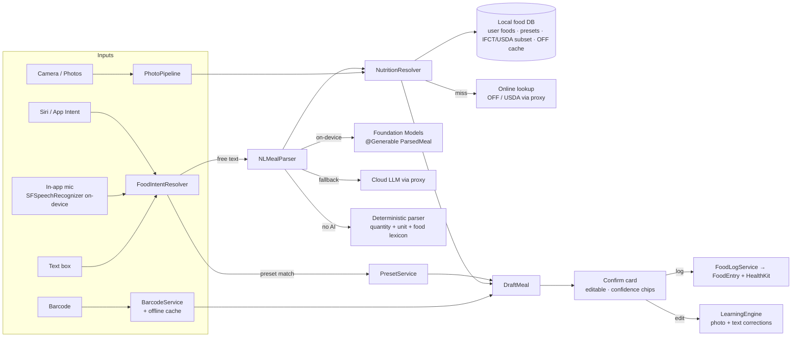

# 04 — Food Logging 2.0: Presets, Voice / Natural Language, Photo

> **Squad:** Nutrition & AI · **Phase:** P2 · **Depends on:** 01 (`FoodEntry`, `MealPreset`), 07 (AI proxy, no client keys) · **Feeds:** 03 (intake), 05 (assistant tools), 06 (automations)

---

## 1. Goal

Logging a meal takes **under 5 seconds** however the user chooses to do it, and the AI takes care of the bookkeeping:

| Method | Example | Target time |
|---|---|---|
| **Preset by voice** | "Hey Siri, log my usual breakfast in LifeOS" | ≤ 3 s, zero taps |
| **Natural language** (typed or spoken in-app) | "2 rotis, dal and a bowl of curd for lunch" | ≤ 5 s |
| **Photo** | Snap the plate → confirm | ≤ 6 s p50 |
| **Barcode** | Scan → confirm (works offline for known items) | ≤ 3 s |
| **Smart suggestion** | 8:10 am notification: "Log usual breakfast?" → *Log* | 1 tap |

"AI manages on its own" means it:
- learns repeated meals and **proposes presets**
- fills in nutrition from databases and asks only when unsure
- **remembers corrections** (this already exists for photos and is extended to text)
- auto-assigns the meal slot by time of day and habits
- can auto-log routine presets **with user consent** (doc 06)

---

## 2. Current state

| Capability | Today | File |
|---|---|---|
| Search / recent / favourites / custom foods | Yes (recent capped at 20, custom at 50, 8 hard-coded common foods) | `Managers/FoodDatabaseManager.swift`, `FoodSearchView`, `CustomFoodView` |
| Barcode | OpenFoodFacts online only | `Services/BarcodeFoodLookup.swift`, `BarcodeScannerView` |
| Photo AI | Groq vision (**user pastes own key**) → Apple Vision fallback → learned overrides. Natural-language refine ("I added 4 eggs"). | `Services/MealVision/*`, `AIMealScanView`, `MealResultView` |
| Learning | `MealLearningEngine` (pHash + feature print retrieval, few-shot hints), `LearnedCorrectionsView` | `Services/MealVision/*` |
| Presets (multi-item meals) | **No** | — |
| Voice / Siri / NL text logging | **No** | — |
| Micronutrients / fibre | **No** (`FoodItem` has kcal/P/C/F only) | `Models/MealModels.swift` |
| Regional foods | `NutritionDatabase` is Western-centric (pizza, burger, hot dog…) | `Services/MealVision/NutritionDatabase.swift` |

Keep the MealVision architecture: orchestrator, typed `MealScanError`, never-dead-end fallback, model fallback list. It's the right pattern, so this doc extends it to text and voice.

---

## 3. Architecture



**Key principle:** the LLM **only parses** ("2 rotis" → `{food: "roti", qty: 2, unit: "piece"}`). Calories and macros come from the **NutritionResolver** (databases plus the user's own foods), not from the LLM. Exception: for photos of mixed dishes with no database match, the vision model's estimate is used and marked `confidence < 0.7`.

---

## 4. Feature specs

### 4.1 Meal presets
```swift
@Model final class MealPreset {
    @Attribute(.unique) var id: UUID
    var name: String                 // "Usual breakfast"
    var aliases: [String]            // ["my breakfast", "usual breakfast", "morning oats"]
    var defaultSlot: MealSlot?
    var items: [PresetItem]          // food ref + quantity + unit + macros snapshot
    var icon: String?                // SF Symbol / emoji
    var usageCount: Int
    var lastUsedAt: Date?
    var typicalTimeOfDay: DateComponents?  // learned (median log time)
    var autoLogPolicy: AutoLogPolicy // .never (default) / .suggest / .autoWithUndo — see doc 06
}
```
- Create from: (a) any logged meal ("Save as preset"), (b) the preset builder, (c) the **AI proposal**: when the same item set (Jaccard ≥ 0.8) is logged ≥ 3 times in 14 days in the same slot, show "Save as *Usual breakfast*?".
- Log a preset with a **quantity multiplier** ("half my usual lunch" → ×0.5) and per-item tweaks before confirming.
- Presets are exposed to Siri/Shortcuts as an `AppEntity` (§4.4), so their names become voice-callable automatically.

### 4.2 Natural-language parsing (`NLMealParser`)
Output contract (shared by every parser path):
```swift
@Generable struct ParsedMeal {
    @Guide(description: "Meal slot if stated or implied") var slot: MealSlot?
    @Guide(description: "Each distinct food mentioned") var items: [ParsedItem]
    var timeHint: String?            // "this morning", "at 2pm"
}
@Generable struct ParsedItem {
    var foodText: String             // "roti", "dal tadka", "greek yogurt"
    var quantity: Double?            // 2, 0.5
    var unit: String?                // piece, bowl, cup, g, ml, plate, scoop, katori
    var preparation: String?         // fried, grilled, with ghee
    var brand: String?
}
```
Router:
1. **Preset/alias match first** (exact or fuzzy, on-device, < 50 ms).
2. **Foundation Models** on iOS 26+ with Apple Intelligence: guided generation into `ParsedMeal`. This is free, private and offline.
3. **Cloud LLM** via the proxy (doc 07) when on-device is unavailable or returns low confidence.
4. **Deterministic fallback:** a regex + lexicon parser for "<number> <unit> <food>" patterns. Always available.

Unit normalisation table (`UnitNormalizer`) covers regional household units (e.g. *katori*, *roti/chapati piece*, *plate*), each with a gram equivalent per food category.

### 4.3 Nutrition resolution (`NutritionResolver`)
Lookup order:
1. The user's own foods and presets (the highest trust, because they are the user's own ground truth)
2. Text-correction memory (§4.6)
3. The bundled local DB: curated common foods plus a regional pack (e.g. an **IFCT-derived Indian pack** if D7 = yes), stored as a read-only SQLite resource
4. The OpenFoodFacts offline cache (everything scanned or looked up before)
5. Online: OpenFoodFacts search / USDA FoodData Central, **through the proxy**
6. The LLM estimate (flagged low-confidence and highlighted in the UI)

Each resolved item carries `confidence` and `matchSource`. The confirm card shows a subtle chip ("Your food", "Database", "AI estimate").

> **Licensing:** check every dataset's licence before bundling: OpenFoodFacts (ODbL, attribution and share-alike on the database), USDA FDC (public domain), IFCT (check NIN terms). Track this in doc 09.

### 4.4 Voice & Siri (App Intents)
- `LogPresetIntent(preset: MealPresetEntity, multiplier: Double = 1)`. Phrase: "Log \(preset) in \(.applicationName)". Runs **without opening the app** and returns a snippet view with the totals and an Undo button.
- `LogFoodTextIntent(text: String)`: "Log food in LifeOS" → Siri asks "What did you eat?" → the parser runs → confirmation snippet → log.
- `AppShortcutsProvider` registers both so they work with zero setup. Presets are `AppEntity` with `EntityStringQuery` (fuzzy name and alias matching).
- In-app mic button on the Food sheet: `SFSpeechRecognizer` with `requiresOnDeviceRecognition = true` when supported, and live transcript → parser.
- Siri on Apple Watch: the same intents work from the watch (App Intents run in the phone app's process via Siri).

### 4.5 Photo pipeline v2
Builds on `MealScannerEngine`:
- **Custom camera** (`AVCaptureSession`) instead of only the picker: a framing guide, tap-to-focus, flash, multi-shot (up to 3 angles), and "add reference" (hand/fork) for portion scale. The library picker is kept.
- **Pre-check on device:** Vision classification gates "no food detected" before spending a cloud call.
- **Cloud call via proxy** (no user keys, so `AIKeyStore`'s Groq key UI is removed). The existing model-fallback list moves server-side (BE-04).
- **Itemised result** maps onto `NutritionResolver`. Where the vision model names a dish the DB knows, **DB macros win** and the vision portion estimate scales them.
- **Photo storage:** a downscaled JPEG (≤ 1024 px, already produced by `MealImageProcessor`) is stored in the app container with file protection. A thumbnail is shown in the log. Location metadata is never stored. **Re-encoding drops EXIF, so add a unit test that asserts no GPS tags survive.**
- **Learning:** port `CorrectionStore` (JSON file) into the SwiftData `MealCorrection` model. Keep `MealLearningEngine`'s retrieval logic unchanged (it's good) and add tests.

### 4.6 Text-correction memory
When a user edits an NL-parsed item ("roti" → 120 kcal instead of 80), store a `FoodAlias(text: "roti", resolvedFoodID, perUnitMacros, count)`. The next parse of "roti" resolves to the user's version first. This is the text equivalent of the photo learning loop.

### 4.7 Barcode v2
- An offline cache table keyed by barcode (filled on every successful lookup). A cache hit works with no network.
- Batch lookup through the proxy (allows response caching across users, with no PII).
- Unknown barcode → "Snap the nutrition label" → on-device OCR (`VNRecognizeTextRequest`) → parse the per-100 g table → custom food saved against the barcode.

### 4.8 Smart slotting & suggestions
- Slot by time with user-learned windows (median log times per slot from the last 30 days). The defaults are the current fixed slots.
- "Quick add" row on Home: the top 3 predicted items/presets for the current time window (frequency × recency × time-of-day score). This runs on device with no LLM.

---

## 5. Tickets

### P2-A · Data & presets
| ID | Title | Size | Acceptance criteria |
|---|---|---|---|
| FOOD-01 | `FoodEntry` v2 fields | S | Fibre, sugar, sodium (optional), `source`, `confidence`, `presetID`, `photoAssetID` (schema from doc 01) |
| FOOD-02 | `MealPreset` CRUD + builder UI | M | Create from a logged meal or the builder. Edit, reorder, delete. Multiplier logging. |
| FOOD-03 | Preset proposal detector | S | Jaccard rule §4.1. Proposal card at most once per 7 days per pattern. Dismiss is remembered. |
| FOOD-04 | Local food DB resource | L | Read-only SQLite bundled. Curated common foods plus a regional pack (D7). Full-text search < 30 ms. |
| FOOD-05 | `NutritionResolver` | M | Lookup order from §4.3. Each result has `matchSource` and `confidence`. Unit tests for every tier. |

### P2-B · Natural language & voice
| ID | Title | Size | Acceptance criteria |
|---|---|---|---|
| FOOD-06 | `NLMealParser` router | L | Four paths (§4.2). ≥ 90% item-level F1 on the 200-phrase golden set (doc 10, QA-06), including regional phrasings. p50 < 1.5 s on device. |
| FOOD-07 | `UnitNormalizer` | M | Household and regional units → grams per food category. Table-driven tests. |
| FOOD-08 | In-app voice capture | M | On-device speech when available, live transcript, mic permission in context, VoiceOver friendly |
| FOOD-09 | App Intents: `LogPresetIntent`, `LogFoodTextIntent` | M | Work from Siri on iPhone and Watch, Shortcuts and Spotlight. Snippet confirmation with Undo. Logs with `source = .assistant`. |
| FOOD-10 | Text-correction memory | S | §4.6. A second parse of an edited food uses the user's macros. |

### P2-C · Photo & barcode
| ID | Title | Size | Acceptance criteria |
|---|---|---|---|
| FOOD-11 | Remove BYOK Groq key UI | S | `AIKeyStore` Groq path removed. Scanner calls the proxy (BE-03). The existing Keychain entry is deleted on upgrade. |
| FOOD-12 | Custom camera capture | L | §4.5 camera features. 60 fps preview. Works with VoiceOver. Falls back to the picker. |
| FOOD-13 | Photo → resolver integration | M | DB macros win on a recognised dish, and the portion scales them. Low-confidence items are highlighted. |
| FOOD-14 | Port `CorrectionStore` → SwiftData | S | Lossless migration of existing corrections. `LearnedCorrectionsView` reads the new store. |
| FOOD-15 | Barcode offline cache + label OCR | M | §4.7. A cached barcode logs in airplane mode. The OCR path creates a custom food. |
| FOOD-16 | Smart slotting + Quick add | S | §4.8. Prediction hit-rate tracked locally (shown in debug menu). |

---

## 6. UX rules (engineering-enforced)
- Every AI-created draft is **editable before logging**, except preset auto-log, which logs immediately and shows an Undo toast (doc 06).
- Show **uncertainty**, not false precision: kcal is rounded to 5 when `confidence < 0.8`.
- **Undo for 10 s** after any log, from any entry point (in-app, Siri snippet, notification action).
- The user can always see and delete what the AI learned (`LearnedCorrectionsView` is extended to text aliases and presets).

---

## 7. Open questions
1. D7 — which regional packs ship at launch?
2. Should NL logging support **past-time** entries ("yesterday's dinner was…") in v1? (Recommended: yes, limited to the last 7 days.)
3. Micronutrients beyond fibre/sugar/sodium: v1 or later?
