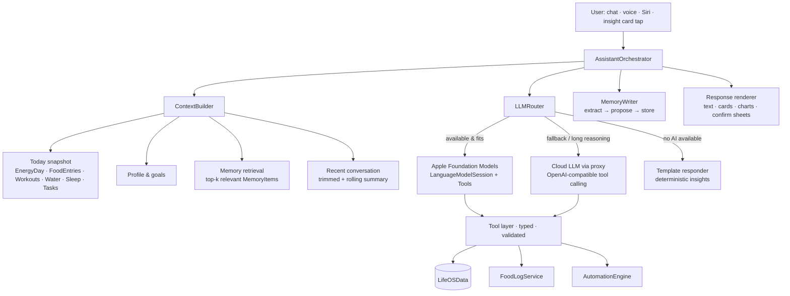

# 05 — AI Assistant: Context-Aware, With Memory

> **Squad:** Nutrition & AI · **Phase:** P3 · **Depends on:** 01 (store), 02/03 (energy data), 04 (food tools, parser), 07 (cloud proxy) · **Feeds:** 06 (automation insights)

---

## 1. Goal

A personal assistant inside LifeOS that **knows the user's day and history**, **remembers** preferences and facts over time, and **acts** for them (logs food, sets reminders, builds presets, plans meals). It runs **on-device first and for free**, with a cloud fallback.

### What it should handle (golden examples)
| Ask | Behaviour |
|---|---|
| "How am I doing today?" | Pulls budget, intake, macros, workouts, water and sleep, then gives a 2–3 sentence status with exact numbers |
| "What can I eat for dinner with what I have left?" | Uses remaining kcal/macros, diet type and remembered dislikes to suggest 3 options. Offers to log one. |
| "Log 2 eggs and toast" | Calls the parser + resolver (doc 04), shows a confirm card, logs |
| "Why is my budget higher today?" | Reads `BudgetBreakdown` (doc 03) and explains the Watch credit |
| "I don't eat mushrooms" | Saves a memory item (shown to the user) and uses it in future suggestions |
| "Compare this week to last week" | Calls trend tools and answers with a small chart card |
| "Remind me to drink water every 2 hours tomorrow" | Creates an automation (doc 06) after confirmation |
| "What did I eat last Tuesday?" | Queries the store by date (needs the date-keyed history from doc 01) |

### Non-goals (v1)
- Medical diagnosis or treatment advice
- Open-ended chit-chat unrelated to the user's life data (allowed, but not optimised)
- Cross-device conversation sync (local-first, decision D3)

---

## 2. Architecture



### 2.1 LLM router policy
| Condition | Route |
|---|---|
| `SystemLanguageModel.default.availability == .available` and the task is simple (status, log, small Q&A) | **On-device** |
| On-device unavailable (older device, Apple Intelligence off, not iOS 26) | **Cloud** (if online and quota OK) |
| Context > on-device budget after trimming, or multi-step planning (weekly meal plan) | **Cloud** |
| Offline and no on-device model | **Template responder** with a clear message ("Smart answers need a connection") |
| Free-tier quota exhausted (proxy returns 429 with `retryAfter`) | On-device if possible, else template + "back in X min" |

Abstract both behind `protocol LLMProvider { func respond(_ req: AssistantRequest) async throws -> AssistantTurn }` so providers can be swapped and tested with fakes.

---

## 3. Context builder

### 3.1 Budgeted context
The on-device model has a **small context window**, so the context is assembled under a token budget with priorities:

| Priority | Block | Typical size | Notes |
|---|---|---|---|
| 1 | System policy (role, safety, tool rules, units) | ~300 tok | Static, versioned |
| 2 | Today snapshot (compact key: value) | ~200 tok | Always included |
| 3 | Profile & goals | ~80 tok | Goal, diet type, target weight, units |
| 4 | Retrieved memories (top-k = 5) | ~150 tok | §4.3 |
| 5 | Rolling conversation summary | ~150 tok | Updated every 6 turns |
| 6 | Last N turns verbatim | remainder | Trimmed oldest-first |

History beyond today is **never** dumped into context. The model calls tools to fetch it. That keeps prompts small and numbers exact.

### 3.2 Snapshot format (example)
```
DATE 2026-10-02 (Fri) 19:40 · tz Asia/Kolkata
BUDGET 1798 kcal (measured mode; watch credit +212) · EATEN 1260 · LEFT 538
MACROS P 82/140g · C 150/190g · F 41/60g · FIBRE 18/30g
WORKOUTS Strength 52m 310kcal (Apple Watch) · STEPS 8,420
WATER 6/8 · SLEEP last night 6h40m · WEIGHT trend 79.4 kg (−0.4/wk)
TASKS 3/5 done · STREAK perfect-day 4
```

---

## 4. Memory system

### 4.1 Three tiers
| Tier | What | Created by | Storage | Used how |
|---|---|---|---|---|
| **Profile facts** | Structured: diet type, allergies, dislikes, schedule ("gym Mon/Wed/Fri 7am"), equipment, cuisine preferences | Onboarding, settings, or confirmed from chat | `UserProfile` + `MemoryItem(kind: .fact)` | Always eligible for retrieval. High priority. |
| **Episodic** | Daily and weekly summaries ("Tue: hit protein, skipped gym, slept 5h") | Nightly BG job (doc 06) — deterministic text from `DailySummary` + optional LLM polish | `MemoryItem(kind: .episode, dayKey:)` | Retrieved for "last week / usually / trend" questions |
| **Semantic notes** | Free-form preferences and insights from chats ("prefers quick dinners on weekdays", "finds evening workouts hard") | `MemoryWriter` proposes, **user confirms** (or auto-saves with a visible "Saved to memory" chip and undo) | `MemoryItem(kind: .note)` + embedding | Top-k similarity retrieval |

```swift
@Model final class MemoryItem {
    @Attribute(.unique) var id: UUID
    var kind: MemoryKind            // fact, episode, note
    var text: String                // human-readable, shown in Memory screen
    var key: String?                // for facts: "dislike.food", "schedule.gym"
    var embedding: Data?            // Float32 vector from NLContextualEmbedding
    var dayKey: String?             // episodes
    var createdAt: Date; var updatedAt: Date
    var source: MemorySource        // userStated, inferredConfirmed, system
    var sensitivity: Sensitivity    // normal, health — health items never leave device unless user allows cloud
    var pinned: Bool
    var expiresAt: Date?            // e.g. "on holiday till Sunday"
}
```

### 4.2 Writing memories (`MemoryWriter`)
1. After each assistant turn, a lightweight extraction prompt (on-device) proposes 0–2 candidate memories as `@Generable [MemoryCandidate]`.
2. Filter: drop duplicates (embedding cosine > 0.92 to an existing item, which becomes an update instead), drop trivia, and drop anything the user didn't actually state.
3. Health-sensitive candidates (conditions, medications, injuries) are **never auto-saved**. They need an explicit "Remember this?" confirmation and are tagged `sensitivity = .health`.
4. Everything saved shows a chip in the chat ("Saved: you don't eat mushrooms · Undo").

### 4.3 Retrieving memories
- Embed the user query on-device (`NLContextualEmbedding`), compute cosine against stored item embeddings (brute force is fine up to ~10k items, < 20 ms), and take the top-k with a recency boost and pinned items first.
- Facts with matching `key` prefixes are always included for relevant intents (e.g. any food suggestion pulls `dislike.*`, `allergy.*` and `diet.*`).

### 4.4 Memory transparency (required)
- **Memory screen** (Profile → Assistant → Memory): list, search, edit, pin, delete, "delete all", "pause memory".
- Export memory as JSON with the rest of the data export (doc 09).
- When cloud routing is used, only items with `sensitivity == .normal` are sent, unless the user enabled "Allow health context in cloud AI" (default **off**).

---

## 5. Tools (function calling)

All tools are typed, validated and **side-effect-free unless marked write**. Write tools never execute directly from model output. They return a **pending action** that the UI renders as a confirm card (except actions the user pre-authorised in automation settings).

| Tool | Kind | Args | Returns |
|---|---|---|---|
| `getDaySummary` | read | `date` | Snapshot block for that day |
| `getRange` | read | `metric` (kcal, protein, weight, workouts, water, sleep, steps), `from`, `to`, `granularity` | Series + aggregates |
| `getBudgetBreakdown` | read | `date` | `BudgetBreakdown` (doc 03) |
| `searchFoods` | read | `query` | Top matches from the resolver |
| `suggestMeals` | read | `kcalLeft`, `macroGaps`, `constraints` | 3 options from user foods/presets/DB (scored in code, the LLM only phrases them) |
| `parseAndDraftMeal` | write-pending | `text`, `slot?` | `DraftMeal` → confirm card |
| `logPreset` | write-pending | `presetID`, `multiplier` | Pending log |
| `createPreset` | write-pending | `name`, `items` | Pending preset |
| `logWater` / `logWeight` | write-pending | value | Pending log |
| `createTask` / `setReminder` | write-pending | title, date, recurrence | Pending task/notification |
| `createAutomation` | write-pending | template ID + params (doc 06) | Pending rule |
| `rememberFact` / `forgetFact` | write-pending | text/key | Pending memory change |

Foundation Models: implement each as a `Tool` with `@Generable` arguments. Cloud: the same schemas exported as JSON Schema for OpenAI-compatible `tools`. **One Swift definition generates both** (a code-gen or macro helper).

**Numbers rule:** the system prompt and an output validator enforce that any number in the reply about the user's data must appear in a tool result from the same turn. Violations are re-generated once, then fall back to the template responder.

---

## 6. Surfaces
| Surface | Phase | Notes |
|---|---|---|
| Assistant sheet (chat) from Home and the tab bar | P3 | Streaming text, rich cards (meal options, charts, confirm sheets), mic input |
| Proactive **insight cards** on Home | P3 | Generated by automation jobs (doc 06). Max 2 per day. Dismissible. |
| Siri / App Intents: `AskLifeOSIntent(question)` | P3 | Snippet answer. Hands off to the app for multi-turn. |
| Notification replies | P3 | "You have 540 kcal left — want dinner ideas?" → opens the assistant with context |
| Watch | Later | Dictate a question → phone answers → short reply on the watch |

---

## 7. Prompting & versioning
- Prompts live in `LifeOSAI/Prompts/*.md` with an ID and version. Responses log `promptVersion` (locally) for debugging.
- Separate prompts: `system.assistant`, `extract.memory`, `summarize.day`, `summarize.conversation`, `suggest.meals.phrasing`.
- Temperature is low (0.2–0.4) for data answers and moderate for meal-idea phrasing.

---

## 8. Safety policy (must ship with v1)
- **No diagnosis or medication advice.** Redirect to a professional. Templates live in `Prompts/safety.md`.
- **Calorie floors are absolute:** the assistant never suggests a plan below the engine floor (doc 03), never praises very low intake, and never suggests compensatory exercise for "bad" eating.
- **Disordered-eating signals** (e.g. repeated very-low intake days, distress language): switch to a supportive tone, stop numeric coaching in that turn, and surface support resources. This behaviour is reviewed with a clinical advisor before launch.
- **Allergies are hard constraints** in `suggestMeals` (filtered in code, not left to the LLM).
- Stay within the 18+ requirement where a provider requires it (doc 07/09).

---

## 9. Tickets

### P3-A · Core
| ID | Title | Size | Acceptance criteria |
|---|---|---|---|
| AI-01 | `LLMProvider` protocol + `LLMRouter` | M | §2.1 policy. Unit-tested routing table. Availability changes observed live. |
| AI-02 | Foundation Models provider | M | `LanguageModelSession` with tools, guided generation, streaming. Graceful handling of `unavailable` reasons. |
| AI-03 | Cloud provider via proxy | M | OpenAI-compatible tool calling through BE-05. Streaming (SSE). Quota-aware errors. |
| AI-04 | Template responder | S | Deterministic answers for the top 10 intents with no LLM |
| AI-05 | `ContextBuilder` with token budgeting | M | §3. Snapshot under 250 tokens for a typical day. Unit tests for trimming. |
| AI-06 | Tool layer (read tools) | M | `getDaySummary`, `getRange`, `getBudgetBreakdown`, `searchFoods`, `suggestMeals`. Results are exact vs DB in tests. |
| AI-07 | Tool layer (write-pending + confirm cards) | L | All write tools produce pending actions → confirm UI → execute → undo |
| AI-08 | Numbers validator | S | §5 rule enforced. Regeneration path tested. |

### P3-B · Memory
| ID | Title | Size | Acceptance criteria |
|---|---|---|---|
| AI-09 | `MemoryItem` store + embeddings | M | On-device embeddings. Top-k retrieval < 20 ms at 5k items. |
| AI-10 | `MemoryWriter` extraction + dedupe | M | §4.2. Health items require confirmation. "Saved" chip with undo. |
| AI-11 | Episodic summaries | S | Nightly job writes one per day (doc 06 AUTO-08). Weekly rollup on Sundays. |
| AI-12 | Memory screen | M | §4.4. Edit, delete, pause, export. Deletion removes embeddings too. |

### P3-C · Experience & quality
| ID | Title | Size | Acceptance criteria |
|---|---|---|---|
| AI-13 | Assistant UI | L | Streaming, rich cards, mic input, conversation list, haptics (motion spec from doc 08) |
| AI-14 | `AskLifeOSIntent` (Siri) | S | Snippet answer for single-turn questions |
| AI-15 | Eval harness | M | 150 golden prompts with expected tool calls and exact numbers. Runs in CI against fakes (doc 10, QA-07). Pass ≥ 95% tool-selection accuracy. |
| AI-16 | Safety suite | M | 50 adversarial/sensitive prompts. 100% policy compliance required to ship. |

---

## 10. Open questions
1. Should the assistant have a **name/persona**? (Engineering impact: prompt and branding only.)
2. Is "Allow health context in cloud AI" offered at all, or is cloud strictly non-health? (Recommendation: offer it, default off.)
3. Clinical advisor for the §8 safety review — who?
