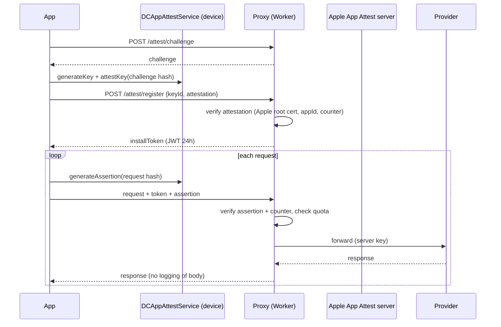

# 07 — AI Backend on Free Tiers (Proxy)

> **Squad:** Backend (1 engineer, can be part-time) · **Phase:** P2 (starts in parallel with P1) · **Depends on:** nothing in-app; needs the Apple Developer account for App Attest · **Feeds:** 04 (photo/NL/barcode), 05 (cloud LLM)

---

## 1. Goal

Remove every API key from the app and from the user's hands. Today the user must paste their own Groq key (`AIMealScanView` + `AIKeyStore`). Instead, a **thin, stateless proxy** that we control:
- holds provider keys server-side
- verifies requests come from our genuine app (App Attest)
- enforces per-install quotas, so one user can't burn the shared free tier
- routes across providers and models, with fallback (moving the model list out of `GroqMealAnalyzer.candidateModels` so a model retirement is a config change, not an App Store release)
- **stores no user data**

---

## 2. Platform choice

| Option | Free allowance | Fit |
|---|---|---|
| **Cloudflare Workers** (recommended) | A free plan with a daily request cap (verify current limits) | Edge, fast cold start, secrets, KV/Durable Objects, streaming responses, simple deploys via Wrangler |
| Vercel / Netlify functions | Free hobby tiers | OK, but heavier cold starts and hobby-tier licence terms |
| Firebase Cloud Functions | Requires the Blaze (pay-as-you-go) plan for outbound calls | Not free in practice |
| Self-host on a free VM | — | Ops burden. Skip. |

---

## 3. API (v1)

Base: `https://api.lifeos.app/v1` (custom domain on the Worker)

| Method & path | Purpose | Request | Response |
|---|---|---|---|
| `POST /attest/register` | One-time App Attest key registration | `keyId`, `attestation`, `challenge` | `installToken` (short-lived JWT, 24 h) |
| `POST /attest/challenge` | Fresh challenge | — | `challenge` |
| `POST /vision/meal` | Meal photo analysis (replaces the direct Groq call) | JPEG (≤ 1.6 MB, already produced by `MealImageProcessor`), optional `hints`, optional `refinement` | `MealAnalysis` JSON (same contract as today's `Payload`) |
| `POST /parse/meal` | NL meal parsing fallback (doc 04) | `text`, `locale` | `ParsedMeal` JSON |
| `POST /chat` | Assistant cloud path (doc 05), **SSE streaming** | messages, tools (JSON Schema), `contextPolicy` | OpenAI-compatible stream incl. tool calls |
| `GET /food/barcode/{code}` | OpenFoodFacts proxy + edge cache | — | Normalised food |
| `GET /food/search?q=` | OFF/USDA search proxy + cache | — | Normalised foods |
| `GET /config` | Remote config / feature flags / model lists / quota numbers | app version | JSON (cache 1 h) |

All endpoints except `/attest/*` and `/config` require `Authorization: Bearer <installToken>` **plus** an App Attest assertion header on POSTs.

---

## 4. Security model



- **App Attest** isn't available on the simulator or some devices. Fall back to **DeviceCheck** plus a stricter quota, and allow a debug bypass only in non-production environments.
- The provider keys live only in Worker secrets. They are rotated quarterly and on any suspected leak.
- **Rate limits:** per install (token bucket) and globally (circuit breaker when the provider returns 429). Use Durable Objects or the Workers rate-limiting binding (check free-plan availability).
- **No body logging.** Logs hold only route, status, latency, model, token counts and a hashed install ID. Retention ≤ 7 days.
- CORS is disabled (app-only). Payload size limits are enforced at the edge.

---

## 5. Provider router

```yaml
# served from /config and used server-side
routes:
  vision.meal:
    - { provider: groq, models: ["<current vision model 1>", "<current vision model 2>"] }
  parse.meal:
    - { provider: groq, models: ["<small fast text model>"] }
  chat:
    - { provider: groq, models: ["<tool-calling text model>"] }
policy:
  personal_data_allowed_providers: [groq]     # NEVER list a provider whose free terms allow training/human review on inputs
  retry: { max_attempts: 2, backoff_ms: [600, 1400] }   # mirrors current GroqMealAnalyzer
  skip_on_status: [400, 404, 422]                       # retired model → next candidate (current behaviour)
```
- Model names are **config, not code**. The current app code lists Groq models chosen in Sep 2026. Verify the live lineup at implementation time.
- **Provider eligibility rule:** before adding any provider, the Tech Lead checks its free-tier data terms. For example, Google's Gemini API terms for unpaid usage say inputs may be used to improve products and reviewed by humans, and ask developers not to send personal information. So the Gemini free tier is **excluded** for any route carrying food, health or memory data.
- Record each provider's data-retention and training terms in `docs/providers.md` and re-check quarterly.

---

## 6. Quotas & graceful degradation

| Resource | Default per install / day (tunable via `/config`) | When exceeded |
|---|---|---|
| Photo scans | 25 | Response `429 {retryAfter, reason:"daily_quota"}` → the app uses on-device Vision (existing fallback) and shows "AI scans refresh at midnight" |
| NL parse calls | 100 | App uses the on-device/deterministic parser |
| Chat turns (cloud) | 60 | Assistant routes on-device or to templates (doc 05 §2.1) |
| Barcode/search | 300 | Serve from cache only |

Global protection: if the provider returns 429 for > 30 s, open a circuit breaker for 60 s, return `503 {retryAfter}`, and let the app degrade. **Free tiers mean the shared limit is per provider account**, so for a public launch either fund a paid tier or keep the on-device-first routing as the main path (master plan §7).

---

## 7. Tickets

| ID | Title | Size | Acceptance criteria |
|---|---|---|---|
| BE-01 | Worker project, environments, CI deploy | S | `dev`/`prod` environments, secrets via Wrangler, deploy on tag, custom domain |
| BE-02 | App Attest register/assert + JWT | L | §4 flow. Counters tracked. DeviceCheck fallback. Unit tests with Apple sample attestation vectors. |
| BE-03 | `/vision/meal` | M | Contract-compatible with today's `GroqMealAnalyzer` output. Model fallback. p50 latency overhead < 150 ms over direct. |
| BE-04 | Provider router + config-driven model lists | M | §5. Retired-model skipping. Per-route provider policy. |
| BE-05 | `/chat` with SSE streaming + tool schemas | L | Pass-through of OpenAI-compatible tool calls. Streaming works through the Worker. Tested with the iOS client. |
| BE-06 | `/parse/meal` | S | JSON-mode output validated against the `ParsedMeal` schema |
| BE-07 | Food proxy + edge cache | M | OFF/USDA normalisation. Cache 30 days. ODbL attribution fields preserved. |
| BE-08 | `/config` remote config | S | Flags, quotas, model lists, kill-switches. Cached 1 h by the client (FND-22). |
| BE-09 | Quotas, rate limits, circuit breaker | M | §6. Load test: 50 rps burst handled with correct 429s. No provider overage. |
| BE-10 | Observability without PII | S | Metrics dashboard (requests, errors, latency, model, quota hits). No bodies stored. |
| BE-11 | iOS `LifeOSAPIClient` | M | Typed client in `LifeOSAI`: attest bootstrap, token refresh, assertion signing, retry/backoff, typed errors mapped to the existing `MealScanError` cases. Replaces direct Groq calls. |

---

## 8. Open questions
1. Domain name for the API?
2. Budget appetite if beta usage exceeds free limits (e.g. switch the vision route to a paid tier first, since photos are the heaviest)?
