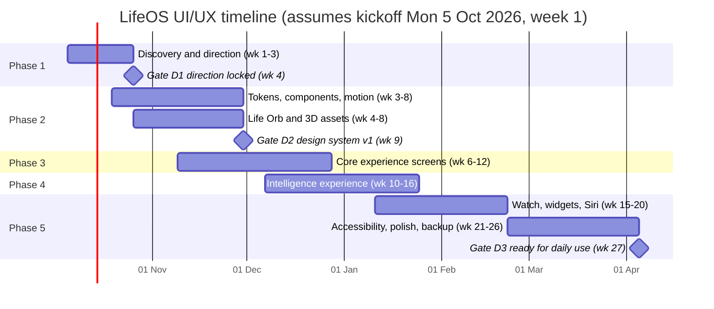

# LifeOS: UI/UX Master Plan

**Team:** UI/UX design (product design, motion/3D design) with one iOS UI engineer. The same plan works for one person doing every role, just on a longer timeline.
**Version:** 1.1, 3 October 2026 (rewritten for a free, personal-use build)
**Codebase reviewed:** `LifeOS-main` at commit `0156906` (SwiftUI iPhone app + watchOS companion)
**Scope:** a personal app for the owner's own iPhone and Apple Watch, built and installed from Xcode with a free Apple account. Nothing in this plan costs money: no Apple Developer Program, no App Store, no TestFlight, no paid tools, no paid AI.

LifeOS should look and feel like an app commissioned privately for its owner: calm, precise, tactile, with one signature 3D object. This master plan sets the direction, the rules and the timeline. Five phase documents hold the detailed work.

---

## 1. Document set

| File | Phase | Weeks | What the team delivers |
| --- | --- | --- | --- |
| `00_UIUX_Master_Plan.md` | All | 1–26 | Direction, principles, IA, design-system rules, timeline, process |
| `01_Phase1_Discovery_and_Direction.md` | 1 | 1–3 | Audit, research, three brand directions, chosen direction |
| `02_Phase2_Design_System_and_3D.md` | 2 | 3–8 | Tokens, components, motion system, the Life Orb and other 3D assets |
| `03_Phase3_Core_Experience.md` | 3 | 6–12 | Today, Capture (food presets, voice, photo), workouts and calorie budget, onboarding |
| `04_Phase4_Intelligence_Experience.md` | 4 | 10–16 | AI assistant, memory, insights, automations |
| `05_Phase5_Ecosystem_Polish_Launch.md` | 5 | 15–26 | Apple Watch, widgets, Live Activities, Siri, accessibility, backup and the 7-day reinstall routine |

Phases overlap on purpose. Engineering builds Phase N screens while design works on Phase N+1.

If kickoff moves, shift every date by the same number of days. Week numbers in all phase docs stay the same.

---

## 2. What we are starting from

Two sources: the three screenshots in `LifeOS/Assets.xcassets` (IMG_2359, 2360, 2362), which predate the current build, and the current SwiftUI code.

**What is worth keeping**

- A dark-first, card-based layout and a floating glass tab bar (`ContentView.customTabBar`).
- Early design tokens: `ThemePalette` (mint `#70EDC6` primary, violet `#8C99FA` secondary), the radius scale in `DesignSystemKit.swift` (12 / 16 / 22 / 28) and the `GlassSurface` modifier.
- Strong product ideas: a calorie budget hero, a "perfect day" streak, a photo meal scanner that learns from corrections.

**What makes it look like a prototype, not a premium product**

| # | Problem | Where | Effect on the user |
| --- | --- | --- | --- |
| A1 | Colour has no fixed meaning. Orange marks both "0/0 Done" and "Low Protein", blue marks weight and links, green marks calories burned | Home grid, meal sheet | Nothing reads as good, bad or neutral at a glance |
| A2 | The hero ring shows "0 of 1,500" with no explanation of what moves it | Home | The main number feels arbitrary |
| A3 | Tiles are text-only and all the same weight; no icons, charts or hierarchy | Daily Progress grid | The screen reads like a form |
| A4 | The floating "+" covers content, and the last row slides under the tab bar ("7.0 kg to go" is clipped) | Home | Feels unfinished |
| A5 | Detail views are centred floating cards with their own close and arrow buttons, not native sheets | Weekly Workout, Today's Meals | Inconsistent dismissal, cramped content |
| A6 | Date navigation is three text links ("Previous · Pick Date · Next") | Home header | Clumsy, and it fights the large title |
| A7 | Empty states repeat "No items added" and "0 cal" with no help or next step | Meals, workouts | The app looks broken on day one |
| A8 | System fonts at default weights, no type scale, emoji used as UI (mood tile) | Everywhere | Generic, not high-end |
| A9 | Motion is limited to default springs; no choreography, haptics or 3D | Everywhere | Flat, no sense of craft |
| A10 | Very large view files (`FoodFlowViews.swift` 1,448 lines, `TabViews.swift` 1,175) | Code | Redesign must come with component extraction, or changes will be slow |

---

## 3. Experience principles

These five rules settle design debates. If a screen breaks one, it goes back.

1. **Calm by default, precise on demand.** The first glance shows one answer, such as "640 kcal left". Detail opens on touch. No screen shows more than three numbers above the fold.
2. **The app does the work.** Logging should take one tap, one sentence or one photo. AI fills in, the user confirms. Never show an empty form when a smart guess exists.
3. **Every number explains itself.** Any metric can be tapped to show where it came from: "Budget 1,793 = 1,571 base + 222 earned from your 6:40 pm workout".
4. **Tactile and alive, never noisy.** 3D, motion and haptics reward real events (meal logged, workout synced, streak kept). Nothing animates without a reason. Reduce Motion gets an equally beautiful static version.
5. **Discreet by design.** Health data is private. The UI should show this (for example an "On device" badge on AI answers, clear privacy screens) and never shame. Over budget is shown in a warm amber, never an alarm red.

---

## 4. Brand positioning for the design

- **Audience:** one person, the owner. Busy, wears an Apple Watch daily, and expects hotel-concierge service from software. Every design decision can be judged by one question: "Does this make *my* day easier?"
- **Feels like:** a private bank's app, a luxury watch's companion app, a five-star hotel's in-room tablet. Restrained, confident, warm.
- **Does not feel like:** a gamified fitness app. No confetti, cartoon mascots, loud gradients or exclamation marks.
- **Voice:** short, calm, specific. "Logged. 412 kcal, 31 g protein." rather than "Awesome job!!! 🎉".

Phase 1 explores three visual directions within this position (see `01_Phase1_...`).

---

## 5. Information architecture

Today the app has four tabs (Home, Streaks, Todo, Profile) and a floating "+" that opens 14 quick actions. Proposed:

| Tab | Purpose | Replaces |
| --- | --- | --- |
| **Today** | The Life Orb, budget, what's next, AI daily brief | Home |
| **Nutrition** | Meals, presets ("My Meals"), macros, history | Food sheets inside Home |
| **Capture** (centre, raised) | Log anything: say it, type it, snap it, scan it, or pick a preset. Long-press opens the Assistant | Floating "+" and Quick Actions menu |
| **Training** | Workouts synced from Apple Watch, sets, activity, trends | Gym week sheet |
| **You** | Profile, goals, streaks, todos and habits, memory, automations, settings | Profile, Streaks, Todo |

The **Assistant** opens from the Capture button (long-press), from Siri, or from the "Ask" glass chip at the top of Today. It is a layer over any screen, not a separate tab, so it always sees the screen's context.

Navigation rules:

- Native sheets with detents (`.medium`, `.large`) for every detail view. No centred floating cards.
- Swipe left and right on the Today header to change day, with a calendar button for longer jumps. This replaces the text links.
- Zoom transitions (`navigationTransition(.zoom)`, iOS 18+) from a card to its detail screen.

---

## 6. Design-system rules (summary)

Full specification in Phase 2. The rules every screen must follow:

| Area | Rule |
| --- | --- |
| Platform look | iOS 26 Liquid Glass for tab bar, toolbars, sheets and floating controls (`glassEffect`, `GlassEffectContainer`). Cards sit on solid surfaces, not glass on glass |
| Colour | Brand colours for identity, separate **data colours** for metrics (energy, protein, carbs, fat, water, activity, sleep) and **status colours** (on track, attention, over). One meaning per colour, everywhere |
| Type | Free Apple fonts only: New York (serif) for display numbers and headlines, SF Pro for UI text, SF Mono or SF Pro rounded digits for tabular data. All styles support Dynamic Type |
| Grid | 4 pt base unit, 20 pt screen margins, 12 pt gaps between cards |
| Shape | Existing radius scale: 12 (chips), 16 (tiles), 22 (cards), 28 (sheets, hero), continuous corners |
| Depth | Three elevation levels only: flat, raised (card), floating (glass controls). The 3D layer is reserved for signature objects |
| Iconography | SF Symbols 7 with hierarchical rendering and symbol effects (bounce, pulse, draw-on). No emoji in the interface |
| Motion | Named springs and durations from the motion spec. Every motion has a Reduce Motion fallback |
| Haptics | Mapped to meaning (success, warning, selection, impact) via `sensoryFeedback`. No haptic without a visible change |

---

## 7. Signature 3D and motion moments

| Moment | What the user sees | Build approach (for engineering estimates) | Phase |
| --- | --- | --- | --- |
| **Life Orb** (Today hero) | A glass sphere that fills like liquid as you eat, glows at the rim when Apple Watch activity raises your budget, and splits into layers on tap | RealityKit `RealityView` with a Reality Composer Pro shader-graph material; 2.5D Metal-shader fallback | 2 → 3 |
| **Depth cards** | Cards tilt a few degrees with the phone and catch light on their top edge | SwiftUI `rotation3DEffect` driven by CoreMotion, plus the existing `GlassSurface` sheen | 2 |
| **Meal lift** | After a food photo, the plate lifts off the background and floats while AI reads it | Vision foreground-mask request + SwiftUI shadow and parallax | 3 |
| **Streak medals** | A 3D medal you can spin with a finger and place on your desk in AR | USDZ assets from Blender; `RealityView` + AR Quick Look | 5 |
| **Assistant orb** | A small luminous orb that breathes while thinking and ripples with your voice | SwiftUI `MeshGradient` + Metal `layerEffect` fed by audio level | 4 |
| **Number rolls** | Calories and macros roll to new values, never jump | `contentTransition(.numericText())` | 2 |

Performance budget for all 3D: stay at the display's frame rate (60 or 120 Hz) on the owner's iPhone, first frame within 300 ms of the screen appearing, all 3D assets 5 MB or less in total, and rendering pauses when off screen, in Low Power Mode or with Reduce Motion on.

---

## 8. Zero cost: tools and free-account limits

### 8.1 Tools (all free)

| Need | Tool | Cost note |
| --- | --- | --- |
| UI design and prototyping | Penpot | Free and open source, no file limits. (Figma's free Starter plan also works but limits files) |
| 3D modelling | Blender | Free, open source |
| 3D materials and scenes for iOS | Reality Composer Pro | Free with Xcode |
| App icon | Icon Composer | Free with Xcode |
| Fonts | SF Pro, New York, SF Mono | Free from Apple for Apple-platform UI |
| Icons | SF Symbols 7 app | Free |
| Lightweight 2D animation | Lottie (lottie-ios) | Free, open source; use only where SwiftUI cannot do it natively |
| Design tokens to code | Tokens exported as JSON → Style Dictionary → Swift | Free, open source |
| Trying designs on device | SwiftUI previews + installing from Xcode on your own iPhone and Watch | Free Apple account (Xcode "Personal Team") |
| Testing | You, using it every day; optionally a friend watching over a free video call | Free |

### 8.2 What a free Apple account means for the design

These limits come from building with a free Apple account instead of the paid Apple Developer Program. Each one changes something in the designs.

| Limit | What it means | Design response |
| --- | --- | --- |
| The installed app stops opening after 7 days until you run it again from Xcode | Reinstalling over the top keeps your data; deleting the app loses it | Phase 5 designs a **backup/export screen** and a gentle "refresh from Xcode in 2 days" reminder |
| Only 10 new App IDs per 7 days | Every extension (widgets, Watch app) uses an App ID | Put all widgets, Live Activities and controls in **one** widget extension |
| No HealthKit inside the Watch app | The Watch app can't run screen-off workout sessions | Workouts come from Apple's own Workout app (the iPhone reads them for free). The LifeOS gym rep counter stays a foreground screen, as it is today |
| No App Store, no TestFlight | No store page, no public beta | No App Store assets in this plan; testing is your own daily use |
| No free Apple Private Cloud Compute | Apple only offers it free to App Store apps in its Small Business Program | AI runs **on device** (Apple Intelligence needs iPhone 15 Pro or newer) or through **free Groq or Gemini keys you enter yourself**; otherwise the existing offline photo classifier |
| Free cloud AI has daily limits; Google may use Gemini free-tier content to improve its products | Heavy days can hit the limit | Design a calm "using on-device estimates for the rest of today" state; show which service saw your data |

---

## 9. Process and handoff

**Weekly rhythm**

- Monday: design and engineering sync (30 min), agreeing what is buildable this week.
- Wednesday: design critique against the five principles.
- Friday: on-device review of what engineering built, compared with the designs.

**Handoff rules**

- Every screen is delivered with all states: loading, empty, partial, full, error, offline, permission denied, first run.
- Every component is delivered in light and dark, at default and the largest accessibility text size.
- Specs reference token names (`color.data.protein`, `motion.spring.snappy`), never raw values.
- Motion is delivered as a short video plus the named spring or curve and its duration.
- 3D is delivered as USDZ with a poly count, texture sizes and a static fallback image.
- Design QA happens on a real device. Simulator screenshots are not enough for glass, 3D or haptics.

**Design gates**

| Gate | Week | Criteria |
| --- | --- | --- |
| D1 · Direction locked | 4 | One direction chosen; moodboard, hero screen and Life Orb concept approved by the owner |
| D2 · Design system v1 | 9 | Tokens in code, 30 core components built and snapshot-tested, motion spec approved, Life Orb prototype running at frame rate on the owner's iPhone |
| D3 · Ready for daily use | 27 | Every screen passes the accessibility checklist; backup and restore tested; the 7-day reinstall routine takes under 2 minutes |

---

## 10. Open decisions for the owner

| Decision | Options | Recommendation |
| --- | --- | --- |
| Minimum iOS version | Keep iOS 17.6, or move to iOS 26 | Match your own iPhone. If it runs iOS 26, target iOS 26 only: Liquid Glass becomes the baseline and there is one look to design |
| On-device AI | Depends on your iPhone | iPhone 15 Pro or newer: design for on-device AI first. Older: design for free Groq/Gemini keys first, with the offline photo classifier as backup |
| Light mode | Dark only, or dark and light | Both; light mode is easier to read outdoors |
| App icon | Keep the current icon, or design a new one | Optional for a personal app. A new mark in Icon Composer (free) makes it feel finished and supports iOS 26 tinted and clear icons |
| Accent direction | Keep mint and violet, or move to the Phase 1 winner | Decide at gate D1 |

---

## 11. References

- Apple Human Interface Guidelines, including Liquid Glass and SF Symbols: https://developer.apple.com/design/human-interface-guidelines/
- Apple, "Bringing your SceneKit projects to RealityKit" (SceneKit is deprecated; build 3D in RealityKit): https://developer.apple.com/documentation/realitykit/bringing-your-scenekit-projects-to-realitykit
- Apple WWDC26 iOS guide (Foundation Models, Private Cloud Compute terms, App Intents, widgets): https://developer.apple.com/wwdc26/guides/ios/
- Apple, supported capabilities by membership (iOS and watchOS): https://developer.apple.com/help/account/reference/supported-capabilities-ios and https://developer.apple.com/help/account/reference/supported-capabilities-watchos
- Free-account limits (7-day profiles, 10 App IDs per 7 days): https://mybyways.com/blog/new-limitations-imposed-on-free-apple-developer-account and https://developer.apple.com/forums/thread/745359
- Google, Gemini API pricing (free-tier data use): https://ai.google.dev/gemini-api/docs/pricing
- Codebase files referenced: `ContentView.swift`, `Managers/AppTheme.swift`, `Managers/DesignSystemKit.swift`, `Views/HomeView.swift`, `Views/Components/HomeComponents.swift`, `Views/FoodFlowViews.swift`, `Views/Tabs/TabViews.swift`, `LifeOS Watch App/Views/WatchTheme.swift`
